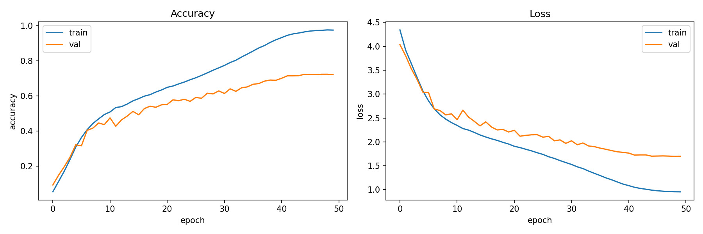
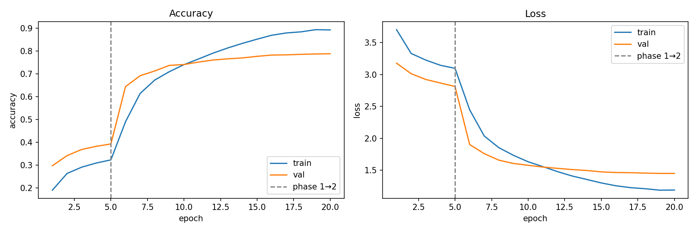
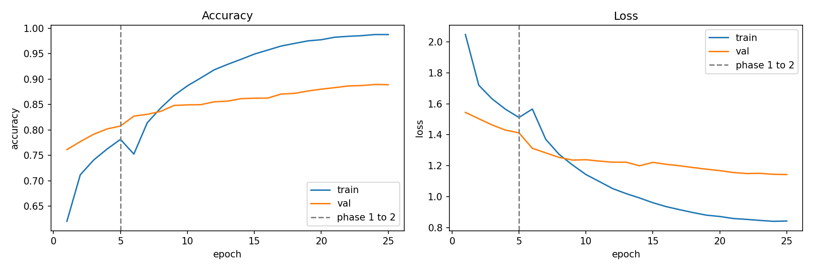

# CS541 Challenge Report

Machine learning image classification challenge for CS541 (Applied Machine Learning), comparing a custom CNN, a fine-tuned pretrained CNN, and a fine-tuned Vision Transformer for robust object recognition.

---

## Part 1: Custom CNN from Scratch

### Architecture
A 5-block CNN called `DeepCNN`. The architecture entail:
- **Stem**: 3-64 channels, 3×3 conv + BatchNorm + ReLU
- **Stage 1**: 2 residual blocks (64-64, stride=1)
- **Stage 2**: 2 residual blocks (64-128, stride=2)
- **Stage 3**: 2 residual blocks (128-256, stride=2)
- **Stage 4**: 2 residual blocks (256-512, stride=2)
- **Head**: Global Average Pooling -> Dropout(0.4) -> Linear(512, 100)

Each ResidualBlock contains two conv layers with BatchNorm and ReLU, plus a skip connection. 

### Hyperparameters
| Parameter | Value |
|---|---|
| Optimizer | SGD + Nesterov momentum |
| Learning rate | 0.1 |
| Momentum | 0.9 |
| Weight decay | 5e-4 |
| Epochs | 50 |
| Batch size | 128 |
| LR schedule | Cosine Annealing |
| Loss | Cross Entropy Loss (label_smoothing=0.1) |

### Regularization
- **Label smoothing (0.1)**: prevents overconfident predictions
- **RandomCrop (32, padding=4)**
- **RandomHorizontalFlip**: left-right flipping with 50% probability
- **ColorJitter**
- **RandomErasing (p=0.25)**: randomly masks out patches

### Results
- Best validation accuracy: **72.15%**
- Clean test accuracy: **73.63%**

### Loss and Accuracy plots

### What Worked
SGD with Nesterov momentum and CosineAnnealingLR converged reliably. The residual connections were also critical so without them, training a would've brought about vanishing gradients. Global Average Pooling significantly reduced parameters compared to flattening.

### What Didn't Work
The model showed a growing gap between train and val accuracy after epoch 30, indicating some overfitting even with regularization. Increasing dropout or adding more augmentation maybe could help.

### What I Learned
That building from scratch has design tradeoffs and paying attention to every architectural choice directly as it affects both accuracy and training stability.

---

## Part 2: Fine-Tuning a Pretrained CNN (ResNet-50)

### Architecture
ResNet-50 pretrained on ImageNet with the final FC layer replaced by a 2-layer MLP head:
`Linear(2048, 512) -> ReLU -> Dropout(0.3) -> Linear(512, 100)`

Input images were resized to 64×64 as a middle ground between CIFAR's 32×32 and ImageNet's 224×224.

### Hyperparameters
| Parameter | Phase 1 | Phase 2 |
|---|---|---|
| Optimizer | Adam | AdamW |
| Learning rate | 1e-3 | 1e-4 |
| Epochs | 5 | 15 |
| Backbone | Frozen | Unfrozen |
| Weight decay | 1e-4 | 1e-4 |
| Loss | CrossEntropyLoss (label_smoothing=0.1) | same |

### Regularization
- Label smoothing (0.1)
- RandomCrop, RandomHorizontalFlip, ColorJitter
- RandomErasing (p=0.25)

### Results
- Best validation accuracy: **78.19%**

### Loss and Accuracy Plots

### What Worked
The two-phase strategy was very effective. Freezing the backbone in phase 1 let the new head stabilize before the pretrained weights were touched, which prevented early instability. The jump from phase 1 to phase 2 val accuracy was significant (~40% -> 78%).

### What Didn't Work
ResNet-50 at 64×64 input still underperforms ViT at 224×224. Upscaling could improve results but was too slow.

### What I Learned
Fine-tuning is really more efficient than training from scratch. ResNet-50 hit 78% val accuracy in 20 total epochs compared to 72% for the custom CNN in 50 epochs.

---

## Part 3: Fine-Tuning a Pretrained Transformer (ViT-B/16)

### Architecture
ViT-B/16 pretrained on ImageNet. The model divides each 224×224 image into 196 patches of 16×16 pixels, processes them as a sequence using multi-head self attention, and produces a classification token. The original head (1000 ImageNet classes) was replaced with:
`Linear(768, 512) -> Relu -> Dropout(0.3) -> Linear(512, 100)`

### Hyperparameters
| Parameter | Phase 1 | Phase 2 |
|---|---|---|
| Optimizer | Adam | AdamW |
| Learning rate | 1e-3 | 1e-4 |
| Epochs | 5 | 35 |
| Backbone | Frozen | Unfrozen |
| Weight decay | 1e-4 | 1e-4 |
| Loss | CrossEntropyLoss (label_smoothing=0.1) | same |

### Regularization and Augmentation
- **RandomResizedCrop(224, scale=(0.7, 1.0))**
- **RandAugment(num_ops=2, magnitude=9)**: applies 2 random strong augmentations per image
- **RandomErasing (p=0.4)**: patch masking for robustness
- **RandomHorizontalFlip**
- **Label smoothing (0.1)**

### Results
- Best validation accuracy: **88.86%**

### Loss and Accuracy Plots

### Top 3 Worst-Performing Classes
| Class | Accuracy |
|---|---|
| boy | 61.22% |
| maple_tree | 68.75% |
| woman | 69.57% |

The confusion between boy/woman and other human categories (man, girl) suggests the model struggles with fine-grained intra-category distinctions when visual features overlap. maple_tree is likely confused with other tree classes as well.

### Top 3 Highest-Confidence Wrong Predictions
| Rank | True Label | Predicted | Confidence |
|---|---|---|---|
| 1 | tulip | rose | 97.02% |
| 2 | possum | bear | 96.46% |
| 3 | squirrel | bear | 96.37% |

These errors show semantically adjacent classes like flowers that share similar petal shapes, and small furry animals with similar textures.

### What Worked
ViT significantly performed better thn both the custom CNN and ResNet models. The global self-attention mechanism allows ViT to capture long-range spatial relationships that CNNs miss with local convolutions. RandAugment meaningfully improved OOD robustness compared to TrivialAugmentWide.

### What Didn't Work
Despite strong val accuracy (88.86%), the OOD Kaggle score was 75.7%. The distortion types in the test set show severe corruptions that the model wasn't exposed to during training.

### What I Learned
ViT is the strongest model for this task, but the gap between clean val accuracy and OOD accuracy shows that augmentation alone may not be sufficient to bridge the distribution shift. Test time augmentation could be needed to close that gap more.

---

## AI Citations

**How I used AI:**
- Architectural guidance for the ResNet-style CNN design and `ResizeWrapper` class
- Debugging shape mismatches and package errors when switching interfaces from Colab.
- structure for the ResNet-50 and ViT fine-tuning